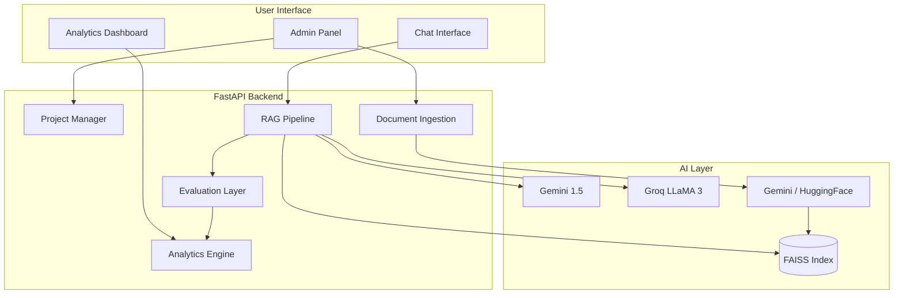

# RAGOps: Enterprise-Grade RAG Platform

> **Admin-Controlled, Project-Based Retrieval Augmented Generation System**
>
> *Built with Next.js, FastAPI, LangChain, and PostgreSQL.*

## 🚀 Problem Statement

In the rapidly evolving landscape of Generative AI, organizations face three critical challenges when deploying RAG (Retrieval Augmented Generation) solutions:

1.  **Data Isolation & Security**: Generic chatbots lack boundaries. Sensitive HR documents shouldn't mix with casual internal wiki searches.
2.  **Hallucination Control**: "Black box" AI systems often answer questions without grounding, leading to misinformation. Admins need control over *what* the AI knows.
3.  **Lack of Transparency**: Users rarely know *why* an AI gave a specific answer. Was it from the Policy Document v1 or v2?

**RAGOps** solves this by introducing a strict **Project-Based Architecture** with **Admin-Controlled Context**, **Multi-Model Orchestration**, and **Built-in Quality Evaluation**.

---

## ✨ Key Features

| Capability | Admin | Client |
|------------|:-----:|:------:|
| Upload documents (PDF/TXT) | ✅ | ❌ |
| Configure RAG params (Chunk size, Top-K, etc.) | ✅ | ❌ |
| Model orchestration (Primary / Fallback LLM) | ✅ | ❌ |
| Switch embeddings (Google Cloud / Local HF) | ✅ | ❌ |
| Session-only model switch (Chat header) | ✅ | ✅ |
| View analytics dashboard (Usage, Latency, Quality) | ✅ | ❌ |
| Chat with knowledge base | ✅ | ✅ |
| View citations & Quality badges | ✅ | ✅ |
| Citation click analytics | ✅ | ✅ |
| Re-chunk / delete documents | ✅ | ❌ |
| Live model comparison (Parallel execution) | ✅ | ❌ |

### Architecture



### Evaluation & Reliability Signals

Every assistant turn is logged to `QueryLog` with latency, retrieval counts, and **TF-IDF–based** grounding / faithfulness scores (`backend/app/services/rag_evaluator.py`).

| Metric | Target | Notes |
|--------|--------|-------|
| Avg RAG Latency | < 1.5s | Gemini 1.5 Flash / Groq Llama 3 |
| Avg Grounding Score | > 0.80 | TF-IDF Cosine Similarity |
| Hallucination Rate | < 10% | Measured via grounding threshold |
| Embedding Cost | $0.00 | When using local HuggingFace models |
| Citation Engagement | > 30% | Tracked via admin dashboard |

### Usage Analytics

-   **Collection**: `POST /chat/message` writes a `QueryLog` record per response (background task).
-   **Engagement**: `POST /api/analytics/citation-click` tracks user interaction with sources.
-   **Dashboard**: Admin-only `/analytics/[projectId]` features Recharts volume, latency, model mix, and quality trends.

---

## 🛠️ Tech Stack

### Frontend
*   **Framework**: Next.js (App Router)
*   **Styling**: Tailwind CSS + Shadcn UI
*   **Charts**: Recharts
*   **State**: React Hooks + Context API
*   **Animations**: Framer Motion

### Backend
*   **API**: FastAPI (Python)
*   **Database**: PostgreSQL or **SQLite** (default `sqlite:///./ragops.db`)
*   **AI Orchestration**: LangChain (Parallel model comparison)
*   **Embeddings**: **Google Gemini** or **Local HuggingFace MiniLM**
*   **Vector store**: **FAISS** on disk (`faiss_index/`)
*   **LLM providers**: Google Gemini, Groq (Llama 3)
*   **Quality**: scikit-learn TF-IDF engine

### Health
*   `GET /health` → `{"status":"ok"}`

---

## ⚡ Local Setup

**1. Environment** — Copy `.env.example` to `backend/.env` and `frontend/.env.local`.

**2. Backend**
```bash
cd backend
pip install -r requirements.txt
uvicorn app.main:app --reload --host 0.0.0.0 --port 8000
```

**3. Frontend**
```bash
cd frontend
npm install
npm run dev
```

---

**Author**: Amritanshu Yadav
**License**: MIT
